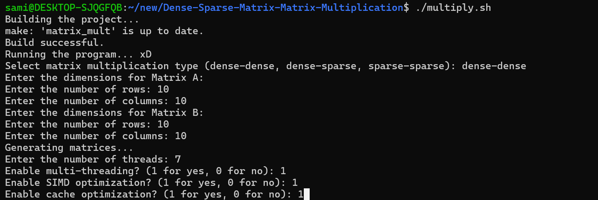
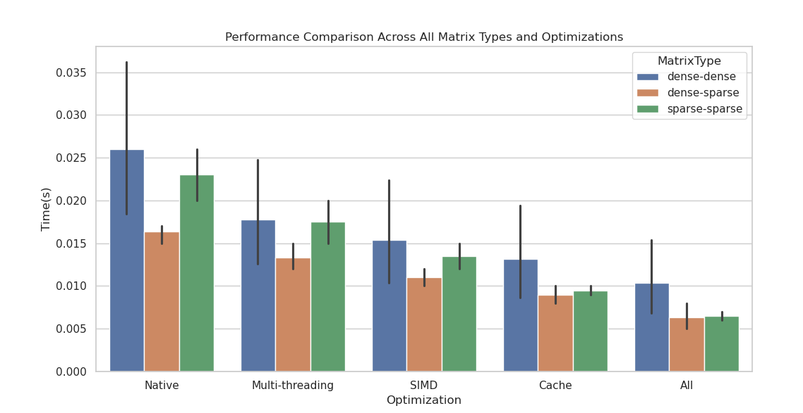
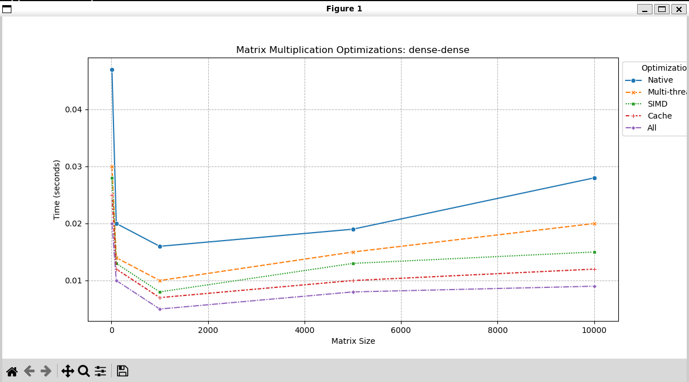
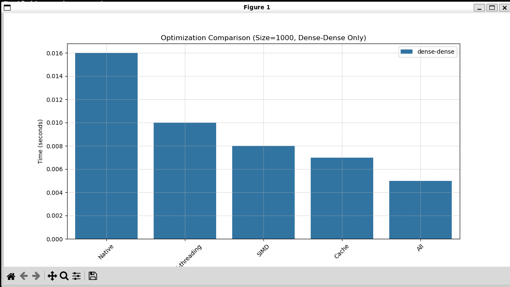

# Dense and Sparse Matrix Multiplication with Multi-threading, SIMD, and Cache Optimization

## Table of Contents
1. [Introduction](#introduction)
2. [Project Features](#project-features)
3. [Setup Instructions](#setup-instructions)
4. [Dependencies](#dependencies)
5. [Code Structure](#code-structure)
6. [How to Run the Experiments](#how-to-run-the-experiments)
7. [Experiments and Results](#experiments-and-results)  
   - [Optimization Impact](#optimization-impact)  
   - [Dense-Dense Matrix Multiplication](#dense-dense-matrix-multiplication)  
   - [Sparse-Sparse Matrix Multiplication](#sparse-sparse-matrix-multiplication)  
   - [Dense-Sparse Matrix Multiplication](#dense-sparse-matrix-multiplication)
8. [Final Analysis and Conclusions](#final-analysis-and-conclusions)
9. [Future Implementations](#future-implementations)

---

## Introduction
This project implements high-performance **dense-dense, dense-sparse, and sparse-sparse matrix multiplication** using C++ with configurable **multi-threading, SIMD optimizations**, and **cache miss minimization techniques**. The software allows you to experiment with **arbitrary matrix sizes** and sparsity levels, providing flexibility to analyze performance for different configurations.

Matrix multiplication is a critical operation in many fields such as **machine learning, computer vision, and scientific computing**. This project provides tools to evaluate how various optimization techniques impact performance under different matrix sizes and sparsities.

---

## Project Features
- **Arbitrary Matrix Sizes:** Supports matrix sizes larger than the cache capacity (e.g., up to **10,000 x 10,000**).
- **Configurable Multi-threading:** Users can specify the **number of threads** to utilize.
- **Configurable SIMD Optimizations:** SIMD-based multiplication can be enabled or disabled.
- **Configurable Cache Optimization:** Cache blocking and access pattern optimizations are tunable.
- **Thread Configuration:** Users can easily modify the **number of threads** to measure performance scalability.

---

## Setup Instructions

### Installation
1. **Clone the Repository:**
   ```bash
   git clone https://github.com/samisrana/Dense-Sparse-Matrix-Matrix-Multiplication.git
   cd Dense-Sparse-Matrix-Matrix-Multiplication

## Dependencies

The following dependencies are required to build, run, and analyze the project:

## Build Dependencies
- **C++ Compiler:** `g++` with AVX/AVX2 support for SIMD operations.
- **CMake:** (Optional) To manage the build process.

## Performance Tools
- **perf:** A Linux performance analysis tool to gather performance metrics such as cache misses, CPU cycles, and thread utilization.

## Python Libraries
For visualization and analysis of results:
- **matplotlib:** `pip install matplotlib`  
- **seaborn:** `pip install seaborn`
- **pandas** `pip install pandas`
## Operating System
- **Linux:** Recommended for multi-threading and performance measurement compatibility with `perf`.

Make sure all dependencies are properly installed before proceeding with the experiments.
### Code Structure

## Key Components

1. **Makefile**  
   - Automates the **build process**, compiling all necessary source files into object files and the final executable.

2. **include/**  
   - Contains **header files** that define the interfaces for matrix operations and optimizations.
   - **matrix_gen.h:** Declares functions for generating matrices of various sizes and sparsities.  
   - **multiplication.h:** Declares functions for matrix multiplication with options for optimizations.  
   - **optimizations/:** Contains headers for **cache** and **SIMD optimizations**.

3. **src/**  
   - Contains **source files** with the implementation of matrix operations and optimizations.
   - **matrix_gen.cpp:** Implements logic for generating random or sparse matrices.  
   - **multiplication.cpp:** Implements matrix multiplication algorithms with support for **native** and **optimized paths**.  
   - **optimizations/:** Contains implementations for **cache optimization** and **SIMD operations**.

4. **scripts/**  
   - **resultsplot.py:** Visualizes experimental results using Python libraries like `matplotlib` and `seaborn`.  
   - **test.sh:** Runs the complete set of experiments (including native multiplication for large matrices).  
     **Note:** This script may take several hours to complete.  
   - **test_cache_vs_native.sh:** Compares the performance of **cache-optimized** vs **native multiplication**.

5. **performance_results.csv**  
   - Stores the **results** from the experiments, including metrics like **execution time** and **cache misses**.

6. **Executable and Object Files**  
   - **matrix_mult:** The final executable for matrix multiplication, generated by the Makefile.  
   - **Object Files:** Intermediate compiled files such as `matrix_gen.o` and `cache_optimization.o` are created during the build process.

7. **main.cpp**
   - **Main C program** in which asks for type of multiplication, sparsity percentage of sparse matrix if asked, size of matrices, how many threads needed, and which optimizations to turn on/off. Also requires arguement to print or not print output.

8. **multiply.sh**  
   - **Bash script** to run Makefile and run main.cpp with print flag on.
to run the full set of experiments, use the following command:
```bash
./multiply.sh
```
<p align="center">
  
</p>

9. **test.sh**  
   - **Bash script** to automate the matrix multiplication experiments. It runs the main.cpp executable (print flag off) with various configurations and collects performance data.

### Experiments and Results
## How to Run the Experiments

to run the full set of experiments, use the following command:
```bash
./scripts/test.sh
```
**NOTE:**  
This experimentation will take **several hours** due to the **native multiplication of 10,000 x 10,000 matrices**.

## Optimization Impact

This section focuses on the impact of various optimization techniques on matrix multiplication performance. Five configurations are analyzed:  
- **Native**: Basic matrix multiplication without optimizations.  
- **Multi-threading**: Parallelizes operations across multiple threads for improved performance.  
- **SIMD**: Utilizes Single Instruction Multiple Data (SIMD) instructions to accelerate matrix operations.  
- **Cache Optimization**: Minimizes cache misses by optimizing memory access patterns.  
- **All**: Combines multi-threading, SIMD, and cache optimizations for maximum efficiency.

Some Observations:

1. **Effectiveness of Optimizations**:
   - Across all matrix types, **multi-threading** and **SIMD** show noticeable performance improvements over the native implementation.  
   - **Cache optimization** provides additional speedups by minimizing cache misses, especially for larger matrices.

2. **Scaling with Matrix Size**:
   - As matrix size increases, the benefit from optimizations becomes more apparent. For example, with a **10,000 x 10,000 matrix**, the **"All" optimization** configuration is significantly faster than using individual techniques alone.  
   - Smaller matrices exhibit fewer differences between optimizations, as computation time is already low.

3. **Impact on Dense vs Sparse Matrices**:
   - **Cache optimization** has the greatest impact on **sparse matrices** by reducing memory overhead, as observed in the **Cache Misses vs Time (Sparse-Sparse)** plot.  
   - For **dense-dense multiplication**, the combination of multi-threading and SIMD provides the most benefit.

4. **Combining Optimizations**:
   - The **Optimization Comparison for 1000x1000 Dense-Dense Matrices** chart highlights that while individual techniques provide some improvements, the **"All" configuration** (multi-threading, SIMD, and cache optimization) delivers the fastest execution.  
   - This trend holds across all matrix types and sparsity levels, confirming that combining multiple optimizations yields the best results.

## Dense-Dense Matrix Multiplication

Dense-dense matrix multiplication involves two matrices where most or all elements are non-zero. This operation is computationally intensive and benefits significantly from parallel processing and SIMD optimizations. 

- **Multi-threading**: Using multiple threads improves performance by distributing the workload across cores. As matrix size increases (e.g., 10,000 x 10,000), the benefits of multi-threading become more pronounced.  
- **SIMD**: SIMD accelerates dense-dense multiplication by processing multiple data points simultaneously. This is especially effective for matrices with continuous data, minimizing the time spent on repetitive computations.
- **Cache Optimization**: While helpful, cache optimization alone has a limited effect, as dense matrices have fewer memory access irregularities compared to sparse matrices. However, it still ensures data locality, reducing cache misses.
- **All Optimizations Combined**: The combination of multi-threading, SIMD, and cache optimization results in the best performance, with significant time savings for large matrix sizes.

---

## Sparse-Sparse Matrix Multiplication

Sparse-sparse matrix multiplication involves multiplying matrices where most elements are zero. This operation is challenging due to irregular memory access patterns and benefits greatly from cache optimization.

- **Cache Optimization**: Cache optimization plays a crucial role by reducing cache misses, which are common when accessing non-contiguous elements. This optimization is the most effective in sparse-sparse multiplication.
- **Multi-threading**: Although multi-threading provides some performance boost, the irregular structure of sparse matrices limits the scalability of thread-based parallelism.  
- **SIMD**: SIMD has limited impact due to the sparse nature of the data, where not all values are available for simultaneous processing.
- **All Optimizations Combined**: Even with the combined use of multi-threading, SIMD, and cache optimization, the performance gain is not as dramatic as in dense-dense multiplication. However, cache optimization remains essential for minimizing memory overhead.

---

## Dense-Sparse Matrix Multiplication

Dense-sparse matrix multiplication involves multiplying a matrix with mostly non-zero elements by a sparse matrix. This operation presents a mix of challenges, requiring both computational power and memory management.

- **Multi-threading**: Multi-threading is effective as it allows for parallel computation of dense matrix rows with sparse matrix columns. The impact increases with larger matrices.
- **SIMD**: SIMD provides a moderate performance boost but is limited by the sparse structure of one matrix. SIMD works best for the dense portion of the operation.
- **Cache Optimization**: Cache optimization reduces cache misses when accessing the sparse matrix’s non-zero elements. This is particularly useful when the sparse matrix is large.
- **All Optimizations Combined**: The combination of multi-threading, SIMD, and cache optimization delivers significant improvements. This approach maximizes performance by leveraging computational power while efficiently managing memory access patterns.
# Final Conclusion and Analysis

The presented graphs provide a comprehensive evaluation of matrix multiplication performance under different optimization strategies, matrix sizes, and sparsity levels. Below is a detailed analysis and key takeaways based on the graphs:

---

## 1. Impact of Optimization Techniques (Line Plot - Dense-Dense Matrix Multiplication)
- The **native multiplication** shows the highest execution time, which grows steeply with larger matrix sizes. This indicates the **lack of optimizations** like cache blocking or SIMD, leading to high computation costs.
- **Multi-threading**, **SIMD**, **cache optimization**, and **combined optimizations ("All")** all improve performance significantly.
- Among the individual techniques, **multi-threading** provides a noticeable improvement, but **combining all optimizations** (SIMD, cache, and multi-threading) yields the **best results**, maintaining low execution time across matrix sizes.

---
### Final Analysis and Conclusion
<p align="center">
  
</p>
<p align="center">
  
</p>

<p align="center">
  
</p>

<p align="center">
  
</p>
The presented graphs provide a comprehensive evaluation of matrix multiplication performance under different optimization strategies, matrix sizes, and sparsity levels. Below is a detailed analysis and key takeaways based on the graphs:

## 2. Optimization Comparison for 1000x1000 Matrix (Bar Plot)
- The bar plot for a **1000x1000 matrix** highlights the performance benefits of different optimizations.
- The **native approach** is the slowest, while each added optimization—multi-threading, SIMD, and cache—contributes to **reduced execution time**.
- The **"All" optimization** achieves the lowest time, emphasizing that combining multiple techniques has a **compounding positive effect**.

---

## 3. Cache Misses vs. Time (Scatter Plot - Sparse-Sparse Multiplication)
- The scatter plot shows the relationship between **cache misses and execution time** for sparse-sparse multiplication.
- As expected, higher **cache misses** correlate with **increased execution time**, particularly for **native and multi-threading approaches**.
- The combined optimizations (cache + SIMD) yield fewer cache misses, demonstrating that **optimized data access patterns** help maintain lower execution time.

---

## 4. Effect of Sparsity Levels on Matrix Multiplication (Line Plot)
- The line plot demonstrates how different sparsity levels (0.0%, 99.0%, and 99.99%) affect the performance for varying matrix sizes.
- For small matrix sizes, higher sparsity (99.99%) results in reduced computation time as fewer non-zero elements need to be processed.
- As matrix size increases, the differences between sparsity levels become less significant, indicating that **computation costs dominate** once the working set exceeds cache size.

---

## 5. Performance Comparison Across All Matrix Types (Bar Plot)
- The bar plot comparing performance across **dense-dense, dense-sparse, and sparse-sparse** matrix types reveals key trends:
  - **Sparse matrices** consistently outperform dense matrices due to the reduced number of non-zero elements involved in computations.
  - **Cache optimization** shows significant performance gains for all matrix types, confirming that **memory access patterns** play a crucial role in matrix multiplication efficiency.
  - **Multi-threading and SIMD** provide additional improvements, particularly for large dense matrices.

---

## Key Takeaways
1. **Optimization Matters:** Each optimization technique (multi-threading, SIMD, and cache) independently improves performance, but the **combination of all techniques provides the best results**.
2. **Matrix Size vs. Optimization Trade-off:** As matrix size grows, optimized methods become increasingly important to manage **computation costs and memory bottlenecks**.
3. **Sparsity Improves Performance:** Sparse matrices benefit from fewer computations, but the performance gains diminish as matrix size increases.
4. **Cache Miss Reduction is Crucial:** Cache optimizations reduce memory access times, which is evident from the scatter plot showing fewer cache misses for optimized methods.

---

## Final Thoughts
This set of experiments highlights the importance of **combining multiple optimization strategies** for high-performance matrix multiplication. While individual techniques (multi-threading, SIMD, and cache optimizations) provide noticeable improvements, their synergy is essential for achieving **optimal performance**, particularly for large, dense matrices. Additionally, **sparsity** plays a vital role in reducing computation costs, but **cache management remains critical** to ensure sustained performance across matrix sizes.

### Future implementations
GPU Support: Implement matrix multiplication on GPUs for even higher performance.
Distributed Computing: Explore distributed matrix multiplication using MPI.
Dynamic Scheduling: Integrate dynamic thread scheduling for better scalability across different workloads.

